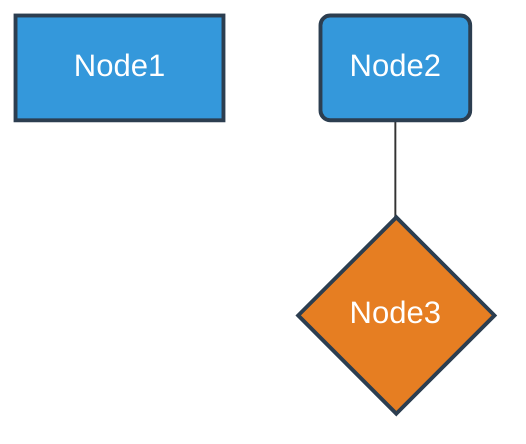

```mermaid
graph TD
    %% Auto-generated diagram
    N1["Node1"]
    N2("Node2")
    N3{"Node3"}

    %% Colors
    style N1 fill:#3498db,stroke:#2c3e50,stroke-width:2px,color:#ffffff
    style N2 fill:#3498db,stroke:#2c3e50,stroke-width:2px,color:#ffffff
    style N3 fill:#e67e22,stroke:#2c3e50,stroke-width:2px,color:#ffffff

    %% Connections
    N2 --- N3
```