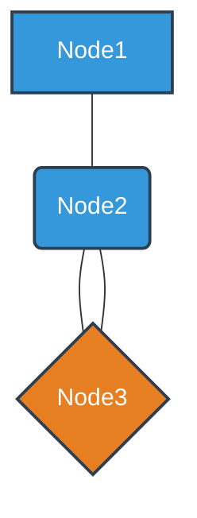

 

```text
graph TD
```


```mermaid
graph TD
     N1["Node1"]
    N2("Node2")
    N3{"Node3"}

    style N1 fill:#3498db,stroke:#2c3e50,stroke-width:2px,color:#ffffff
    style N2 fill:#3498db,stroke:#2c3e50,stroke-width:2px,color:#ffffff
    style N3 fill:#e67e22,stroke:#2c3e50,stroke-width:2px,color:#ffffff


    N2 --- N3


    N2 --- N3
    N1 --- N2
```

---
*Generated by Diagram to Mermaid Converter*